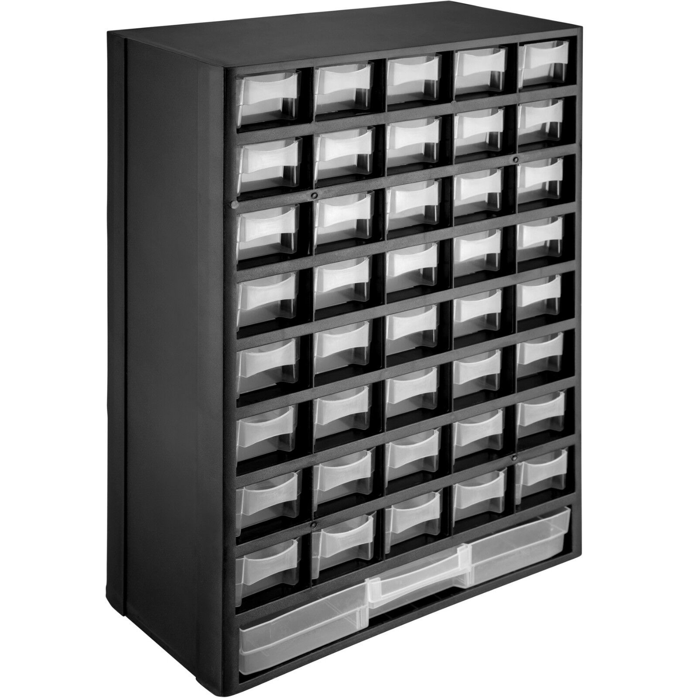

# LEGO Search

LEGO Storage app using ionicframework, Angular, RxJS, TypeScript, and Rebrickable API.

## Getting Started

1. Clone the repo  
  `git clone https://github.com/MichaelBierbaum/LegoStorageWithRebrickable`
2. Navigate to the project folder  
  `cd LegoStorageWithRebrickable` 
3. Open commandline and install dependencies, e.g. the angular commandline interpreter   
  `npm install -g  @angular/cli`
4. Install dependencies
  `npm install`
5. Create an account on rebrickable for using their api
  `https://rebrickable.com`
6. Create an key, copy and paste it into 
  `api_KeyIsMissing.ts`
7. Rename this file to
  `api.ts`
8. Run the app  
  `ng serve`
9. Visit the app in a browser  
  `http://localhost:4200`

## Links

* [Demo of upstream (original repo of this fork)](https://nightwolf.dev/demos/lego)
* [Angular](https://angular.io)
* [RxJS](https://rxjs.dev)
* [TypeScript](https://www.typescriptlang.org)
* [Rebrickable API](https://rebrickable.com/api/)